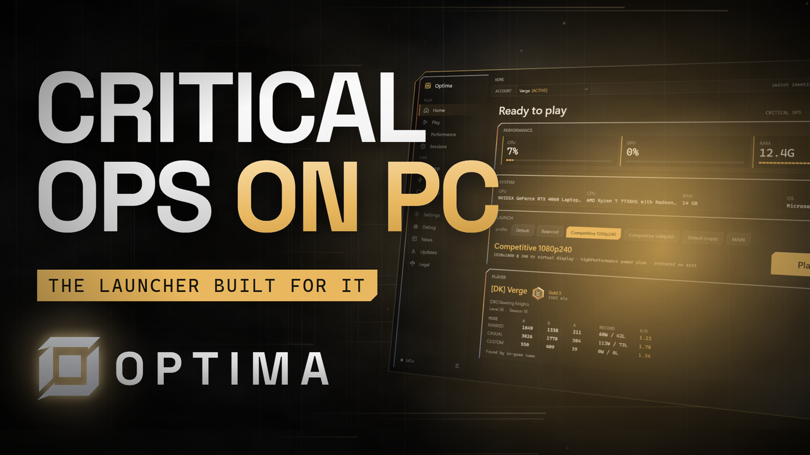

<div align="center">


# Optima

**A Windows launcher and performance companion for Critical Ops on Google Play Games for PC.**

[](https://github.com/inspectsoftware/Optima/releases/latest)
[](https://github.com/inspectsoftware/Optima/releases)


[](https://discord.gg/bGuJ4tvsF7)

[Download](#downloading) · [Features](#features) · [Building](#building) · [Security](#security-boundaries) · [Discord](#community)



</div>

By Inspect Software; see [LICENSE](LICENSE).

Optima runs beside the game, never inside it: no injection, no memory access, no binary or
network tampering. It sets up the environment with documented Windows APIs and restores every
change when the game exits.

## How a session runs


## Features

- **One-click sessions** with Default / Balanced / Competitive profiles or your own.
- **Optima Virtualization**: a bundled virtual display driver, installed by the setup with one
  administrator prompt (or any time from the Display page) for high-refresh modes the monitor
  cannot offer.
- **FPS overlay and session history**: external frametime capture, average / 1% / 0.1% lows,
  per-session network quality, trends and an A-vs-B benchmark that refuses to call noise a gain.
- **Watch mode**: start the game any way you like and Optima applies the profile from the tray.
- **Windows tweaks** with an on/off toggle each, originals captured and restored.
- **Kill switch** (Ctrl+Alt+K), floating log console (Alt+F9), overlay toggle (Alt+F10).
- **Diagnostics and repair**: virtualization, platform, driver and refresh-rate checks with fixes,
  crash bundles from the platform's own logs, and a redacted support export.
- **Discord activity**, ranked session stats from the public Critical Ops profile API, news,
  and a self-updater from GitHub releases.

## Downloading

The latest build is on the [releases page](https://github.com/inspectsoftware/Optima/releases).
Every release carries:

- `Optima-Setup-<version>.exe`, the installer. Per-user, so the wizard itself needs no
  administrator rights; it installs the Optima virtual display driver during setup (one UAC
  prompt, and you can uncheck that step), adds the Start Menu shortcut, offers the optional
  sign-in autostart, and uninstalls cleanly while keeping your data in `%LOCALAPPDATA%\Optima`.
  This is the one to take.
- `Optima-v<version>-win-x64.zip`, the same build as a portable folder. Unpack it anywhere and
  run `Optima.exe`. The in-app updater downloads this same archive to update an existing copy.
- Source code (zip / tar.gz), the repository at that tag, for building it yourself.

> [!NOTE]
> Both binaries are unsigned, so Windows SmartScreen warns about an unknown publisher the first
> time you run either of them.

## Building

Requires the .NET 10 SDK on Windows 10/11.

```bash
dotnet build
dotnet test
```

`.\publish.ps1` produces the runnable self-contained build in `publish/` (it stops a running
Optima first). Add `-Run` to start it.

`.\installer.ps1` packages that build into `artifacts/Optima-Setup-<version>.exe`, a per-user
installer (Start Menu shortcut, optional sign-in autostart, proper uninstaller; user data is
kept on uninstall). Setup also installs the bundled virtual display driver through
`Optima.Watchdog.exe --install-driver`, the same code path the Display page uses. Add `-Publish`
to republish first, `-Run` to launch the setup when done.

Project layout:

```text
src/Optima.Core               logic, models, orchestrator, statistics (no Windows deps)
src/Optima.Platform.Windows   Win32/WMI: display, power, processes, elevation broker
src/Optima.Driver             virtual display providers
src/Optima.Monitoring         hardware monitor, ETW metrics client, SQLite store
src/Optima.Watchdog           the elevated helper (whitelisted commands only)
src/Optima.App                WPF UI
tests/Optima.Tests            xunit suite
```

Without the game: Settings > "mock fps provider" fakes the frametime feed, and
`%LOCALAPPDATA%\Optima\detection.json` with `"emulatorProcessPatterns": ["^notepad$"]` and
`"gameWindowTitlePattern": "Notepad"` lets Notepad stand in for the game.

## Community

Questions, builds and feedback: join the Optima Discord server.

[](https://discord.gg/bGuJ4tvsF7)

## Data

Everything lives under `%LOCALAPPDATA%\Optima\`: `config.json`, `profiles.json`,
`detection.json`, `sessions.db`, `logs/`, `recovery/`, `backups/`, `crashes/`.

## Security boundaries

The UI never runs elevated. `Optima.Watchdog.exe` performs only whitelisted, validated
operations over a private, ACL-restricted pipe. FPS measurement is an ETW present trace. The
app contacts, exhaustively: the game's own endpoints or a reference host (ICMP),
`default.prod.copsapi.criticalforce.fi` (public profile, only with an in-game name set),
`criticalopsgame.com` (news), `api.github.com` (updates), and Discord over local IPC only.
Logs and exports are redacted.

---

<div align="center">
<sub>Optima is an independent project, not affiliated with Critical Force Oy or Google LLC.</sub>
</div>
