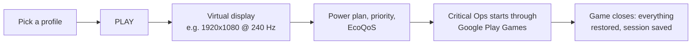

<div align="center">


# Optima

**A Windows launcher and performance companion for Critical Ops on Google Play Games for PC.**

[](https://github.com/inspectsoftware/Optima/releases/latest)
[](https://github.com/inspectsoftware/Optima/releases)


[](https://discord.gg/bGuJ4tvsF7)

[Download](#downloading) · [Features](#features) · [Building](#building) · [Security](#security-boundaries) · [Protected play](#protected-play) · [Discord](#community)


</div>

By Inspect Software; see [LICENSE](LICENSE).

Optima runs beside the game, never inside it: no injection, no binary or network tampering, and it
does not read or change the game's memory. Protected play, for tournaments, is done by a separate
program that is installed with Optima and described under [Protected play](#protected-play). Optima
sets up the environment with documented Windows APIs and restores every change when the game exits.

Two exceptions, both opt-in:

- The Boost memory cleaner empties Windows' standby file cache through the same system call RAMMap
  and ISLC use, which Windows does not document and which has nothing to restore (the cache refills
  by itself).
- The optional 0.5 ms timer step is likewise only reachable through an undocumented call; it is
  released on exit.

## How a session runs



## Features

- **One-click sessions** with Default / Balanced / Competitive profiles or your own.
- **Virtual display**: a bundled virtual display driver, installed by the setup with one
  administrator prompt (or any time from the Display page) for high-refresh modes the monitor
  cannot offer.
- **FPS overlay and session history**: external frametime capture, average / 1% / 0.1% lows,
  per-session network quality, trends and an A-vs-B benchmark that refuses to call noise a gain.
- **Watch mode**: start the game any way you like and Optima applies the profile from the tray.
- **Windows tweaks** with an on/off toggle each, originals captured and restored.
- **Kill switch** (Ctrl+Alt+K), floating log console (Alt+F9), overlay toggle (Alt+F10).
- **Debug page**: one place for what went wrong. Optima reads its own log as it is written and
  runs quick checks in the background, and lists every problem once as an issue, with what it
  means, how to put it right and its evidence; no error goes by unlisted. What it can repair it
  offers as a button, and the safe repairs it runs by itself. Under that: environment checks with
  their fixes (virtualization, platform, driver, refresh rate), a log where any line opens to its
  full error (the whole exception, the code Windows returned, the error guide's fix) and copies as
  a redacted report that stands on its own, crash bundles from the platform's own logs, the error
  guide, and a redacted support export.
- **Discord activity**, ranked session stats from the public Critical Ops profile API, and news.
- **OptimaBot**, the Discord bot that draws Critical Ops stats cards and links your Discord account
  to the game account Optima already tracks: `/link` here, a code into Settings, and `/searchplayer`
  from then on. It also keeps the record of protected play sessions, for tournament organizers. It
  lives in its own repository, [inspectsoftware/OptimaBot](https://github.com/inspectsoftware/OptimaBot),
  so building or installing Optima never needs it.

## Downloading

The latest build is on the [releases page](https://github.com/inspectsoftware/Optima/releases).
Every release carries:

- `Optima-Setup-<version>.exe`, the installer. It asks for administrator rights once and installs
  to `Program Files\Optima`, where only an administrator can change the files: Optima's helper
  runs with administrator rights, so it must not sit in a folder any program of yours can write
  to. The same prompt covers the Optima virtual display driver (you can uncheck that step). It
  adds the Start Menu shortcut and uninstalls cleanly while keeping your data in
  `%LOCALAPPDATA%\Optima`. A copy that 0.7.5 or earlier installed in your own folder is removed
  by it. Starting at sign-in is a switch in Optima's Settings. This is the one to take.
- `Optima-v<version>-win-x64.zip`, the same build as a portable folder. Unpack it anywhere and
  run `Optima.exe`.
- Source code (zip / tar.gz), the repository at that tag, for building it yourself.

> [!NOTE]
> Both binaries are unsigned, so Windows SmartScreen warns about an unknown publisher the first
> time you run either of them.

## Building

Requires the .NET 10 SDK on Windows 10/11.

```bash
dotnet build
dotnet test
```

`.\publish.ps1` produces the runnable self-contained build in `publish/` (it stops an Optima
that runs from that folder first). Add `-Run` to start it.

`.\installer.ps1` packages that build into `artifacts/Optima-Setup-<version>.exe`, a per-machine
installer (Program Files, Start Menu shortcut, proper uninstaller; user data is kept on
uninstall). Setup also installs the bundled virtual display driver through
`Optima.Watchdog.exe --install-driver`, the same code path the Display page uses. Add `-Publish`
to republish first, `-Run` to launch the setup when done.

Project layout:

```text
src/Optima.Core               logic, models, orchestrator, statistics (no Windows deps)
src/Optima.Platform.Windows   Win32/WMI: display, power, processes, elevation broker
src/Optima.Driver             virtual display providers
src/Optima.Monitoring         hardware monitor, ETW metrics client, SQLite store
src/Optima.Watchdog           the elevated helper (a fixed list of commands only)
vendor/shield                 where an official build finds Optima.Shield.exe (not in this repository)
src/Optima.App                WPF UI
tests/Optima.Tests            xunit suite
```

Without the game: Settings > "mock fps provider" fakes the frametime feed, and
`%LOCALAPPDATA%\Optima\detection.json` with `"emulatorProcessPatterns": ["^notepad$"]` and
`"gameWindowTitlePattern": "Notepad"` lets Notepad stand in for the game.

To run a build without touching your own data, set the environment variable `OPTIMA_DATA_DIR`
to a folder: Optima then keeps `config.json`, `sessions.db`, the logs and everything else there
instead of in `%LOCALAPPDATA%\Optima`.

## Community

Questions, builds and feedback: join the Optima Discord server.

[](https://discord.gg/bGuJ4tvsF7)

## Data

Everything lives under `%LOCALAPPDATA%\Optima\`: `config.json`, `profiles.json`,
`detection.json`, `sessions.db`, `logs/`, `recovery/`, `backups/`, `crashes/`, `health/`
(how the last run ended, the fatal error it ended on if there was one, and the issues you chose
to ignore).

## Security boundaries

The UI never runs elevated. `Optima.Watchdog.exe` performs only a fixed list of validated
operations over a private, ACL-restricted pipe. One of them starts Optima Shield with administrator
rights: only the file beside the helper, and only when its SHA-256 is the one that was written into
the helper when this version was built. FPS measurement is an ETW present trace. The
app contacts, exhaustively: the game's own endpoints or a reference host (ICMP),
`default.prod.copsapi.criticalforce.fi` (public profile, only with an in-game name set),
`criticalopsgame.com` (news), `discord.com` (which presence artwork exists, only with presence on),
OptimaBot, the community Discord bot (account linking), the local Discord client over IPC, and
GitHub: `api.github.com` once at every start to ask whether a newer release is out (a switch in
Settings turns that off), and `github.com` for the setup when you press Update.
Optima Shield, while it runs, contacts OptimaBot and nothing else.

Updates: HOME shows a notice when a newer release exists. Update downloads that release's setup,
checks it, and runs it; Windows asks once for administrator approval and Optima reopens when it is
done. The setup is not code-signed, so the check is Optima's own: every release setup has a
signature (`Optima-Setup-<version>.exe.sig`) made with a private key that never leaves the release
machine, over the setup's SHA-256 and its version, and the app carries the public key. A setup
that does not verify is deleted and not run. Previews are never offered.

Optima repairs some problems by itself. It tries the safe repairs first: reversible, no
administrator rights, nothing interrupted. Only where those did not help does it go on to a repair
that interrupts something or needs administrator rights, and it says so in the window first, with
five seconds to stop it. The Debug page has the setting, including "safe repairs only" and "off",
and lists every repair that was ever run. Whatever the setting: nothing is repaired while a game is
running; a repair that interrupts is not run with the window hidden; an administrator prompt
appears at most once per issue per day, never over a hidden window, and not again after it was
declined; and a repair that would make a choice for you (such as overwriting a settings file with
an old backup) is never run unasked. This is the one place where the helper can be started without
a click of yours.

Everything that leaves the app as text is redacted: the log export, a copied report, crash zips
and the support archive mask tokens, the Windows user name, the machine name and user profile
paths, and so does the log's detail pane on the Debug page. The log files on disk are the raw
originals and stay on the PC.

Pressing "link account" in Settings sends the link code, the player identity and this PC's protected
play public key (Optima Shield holds the key and prints its public half) to OptimaBot, once, and
stores the answer. Optima itself sends OptimaBot nothing else; what Optima Shield sends is listed
under [Protected play](#protected-play). Running your own bot: set `discordBotUrl` in `config.json`;
the app has no field for it. A bot you run yourself has no protected play: Shield reports to the
community bot only.

## Protected play

Protected play lets a tournament organizer check that a player's session was watched. It is done by
**Optima Shield**, a separate program installed beside `Optima.exe`.

- Shield is closed source, so that cheat makers cannot read how it looks. It is not in this
  repository, and a build made from this repository has no Shield: it runs without protected play
  and its Settings page says so. Everything this repository does about protected play is in
  `src/Optima.Core/Protection/ShieldLoader.cs`, which starts the program and shows what it says about
  itself, and in the helper's `LaunchShield` command.
- It runs only on a PC that is linked to a Discord account (Settings, DISCORD, "link account"), and
  only after the player has read the "What protected play does" screen. It cannot be turned off
  while the PC is linked. Unlinking (`/unlink` in Discord) turns it off.
- It starts at PLAY, or when watch mode finds the game running, and stops when Optima closes.
  Nothing of it stays behind. It can be ended from Task Manager at any time; the session is then
  recorded as stopped.
- With administrator rights it sees more. PLAY asks for them once, in the same prompt as the helper.
  Without them (the prompt was declined, or the Windows account is not an administrator) it still
  runs, and the session is recorded as reduced coverage.
- While it runs it reports to OptimaBot about every 10 seconds: the Critical Ops account id, its own
  version, the Windows build number, whether it has administrator rights and how long the PC has
  been awake. Each report is signed with a key that was made on this PC and never leaves it.
- In this version no check looks at the PC yet: a session says that Shield ran and reported. The
  "What protected play does" screen lists what the coming versions look at, and this section is
  changed in the same version that starts each of those.
- It never changes, blocks or closes any program, and it bans no one. People read the record and
  decide.
- Who sees what: a player sees their own sessions with `/protected` in Discord. Organizers of a
  Discord server the player is a member of can see, with `/verify`, whether the player is in a
  protected session right now, and nothing else. Organizers of servers that Optima has approved can
  see the session history.

---

<div align="center">
<sub>Optima is an independent project, not affiliated with Critical Force Oy or Google LLC.</sub>
</div>
